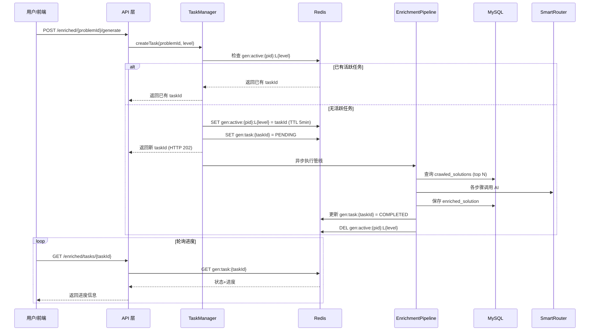

# Design Document: Content Enrichment Pipeline

## Overview

本设计文档描述内容解析系统 v2 的技术架构。系统核心是一条可插拔的 AI Enrichment Pipeline，从已爬取的 top N 社区题解中筛选素材，经过纠错、润色、多语言补全、可视化增强等步骤，生成结构化的高质量解析内容。

**核心设计原则：**
- v2 管线独立于 v1（`ContentPipeline.java` 不修改）
- `enriched_solutions` 新表与 `explanations` 并存
- 异步任务通过 Redis 状态机管理
- 管线步骤可插拔，通过 YAML 配置控制开关
- 前端优先读 enriched，fallback 到 legacy

**技术栈：**
- 后端：Spring Boot 3 + JPA + Redis + MySQL
- AI 路由：SmartRouter（多 provider 路由，已有）
- 前端：Next.js + TailwindCSS + TypeScript
- 异步：Spring @Async + Redis 状态管理


## Architecture

### 系统分层架构

```mermaid
graph TB
    subgraph Frontend["前端层 (Next.js)"]
        UI[题目详情页]
        CC[CollapsibleCard 组件]
        PB[进度条组件]
        LT[LevelTabs 组件]
        SK[SkeletonLoader 组件]
        AD[管理后台]
    end

    subgraph API["API 层 (Spring Boot)"]
        UC[UnifiedExplanationController]
        RC[RawSolutionController]
        AC[AdminEnrichedController]
        FC[FeedbackController]
    end

    subgraph Service["服务层"]
        US[UnifiedExplanationService]
        TM[EnrichmentTaskManager]
        QS[QualityScorer]
        FS[FeedbackService]
        VS[VoteService]
    end

    subgraph Pipeline["管线层 (新增)"]
        EP[EnrichmentPipeline]
        ES[ErrorCheckStep]
        SF[SourceFilterStep]
        PS[PolishStep]
        ML[MultiLangStep]
        VST[VisualizationStep]
        DC[DiversityCheckStep]
        QSS[QualityScoreStep]
    end

    subgraph Infra["基础设施层"]
        DB[(MySQL)]
        RD[(Redis)]
        AI[SmartRouter]
    end

    UI --> UC
    UI --> RC
    CC --> UC
    PB --> TM
    SK --> UC
    AD --> AC
    UC --> US
    UC --> TM
    RC --> US
    AC --> US
    FC --> FS
    US --> EP
    EP --> ES --> SF --> PS --> ML --> VST --> DC --> QSS
    EP --> AI
    TM --> RD
    US --> DB
    US --> RD
    FS --> DB
    VS --> DB
    VS --> RD
end
```

### 核心交互流程




## Components and Interfaces

### 1. EnrichmentStep 接口（管线步骤统一抽象）

```java
package com.algorithm.help.content.enrichment;

/**
 * 管线步骤接口，所有可插拔步骤实现此接口
 */
public interface EnrichmentStep {
    /** 步骤名称（用于配置开关和进度展示） */
    String getName();

    /** 判断该步骤是否适用于当前上下文 */
    boolean isApplicable(EnrichmentContext ctx);

    /** 执行处理逻辑 */
    EnrichmentResult process(EnrichmentContext ctx);

    /** 是否为核心步骤（核心步骤失败则整体失败） */
    default boolean isCritical() { return false; }
}
```

### 2. EnrichmentContext（管线上下文）

```java
@Data
@Accessors(chain = true)
public class EnrichmentContext {
    private Problem problem;
    private List<CrawledSolution> sources;       // top N 原始题解
    private List<CrawledSolution> filteredSources; // 筛选后的子集
    private int targetLevel;
    private String promptTemplate;
    private EnrichmentConfig config;

    // 管线中间产物
    private String polishedContent;
    private Map<String, String> codeImplementations;
    private String visualization;
    private String timeComplexity;
    private String spaceComplexity;
    private float qualityScore;
    private List<String> warnings = new ArrayList<>();
}
```

### 3. EnrichmentPipeline（管线编排器）

```java
@Service
@RequiredArgsConstructor
public class EnrichmentPipeline {
    private final List<EnrichmentStep> steps;
    private final EnrichmentConfig config;

    public EnrichmentPipelineResult execute(EnrichmentContext ctx) {
        for (EnrichmentStep step : steps) {
            if (!config.isStepEnabled(step.getName())) continue;
            if (!step.isApplicable(ctx)) continue;

            EnrichmentResult result = step.process(ctx);
            if (result.isFailed()) {
                if (step.isCritical()) {
                    return EnrichmentPipelineResult.failed(step.getName(), result.getError());
                }
                ctx.getWarnings().add(step.getName() + " 降级跳过: " + result.getError());
            }
        }
        return EnrichmentPipelineResult.success(ctx);
    }
}
```

### 4. EnrichmentTaskManager（异步任务管理器）

```java
@Service
@RequiredArgsConstructor
public class EnrichmentTaskManager {
    private static final String ACTIVE_KEY = "gen:active:%s:L%d";
    private static final String TASK_KEY = "gen:task:%s";
    private static final long ACTIVE_TTL_MIN = 5;
    private static final long TASK_TTL_HOUR = 1;

    private final RedisTemplate<String, Object> redisTemplate;
    private final EnrichmentPipeline pipeline;
    private final ObjectMapper objectMapper;
    private final ConcurrentHashMap<String, Future<?>> runningTasks = new ConcurrentHashMap<>();

    /** 创建或返回已有任务（幂等） */
    public TaskCreateResult createTask(String problemId, int level, boolean force);

    /** 异步执行管线 */
    @Async("enrichmentExecutor")
    public void executeTask(String taskId, EnrichmentContext ctx);

    /** 查询任务状态 */
    public TaskStatus getTaskStatus(String taskId);

    /** 取消任务 */
    public boolean cancelTask(String taskId);

    /** 更新步骤进度 */
    private void updateProgress(String taskId, String step, int completed, int total);

    /** 清理活跃标记 */
    private void clearActiveTask(String problemId, int level);
}
```

### 5. UnifiedExplanationService（统一查询服务）

```java
@Service
@RequiredArgsConstructor
public class UnifiedExplanationService {
    private final EnrichedSolutionRepository enrichedRepo;
    private final ExplanationRepository legacyRepo;
    private final RedisTemplate<String, Object> redisTemplate;

    /** 查询解析列表（enriched 优先，fallback legacy） */
    public UnifiedExplanationResponse getExplanations(String problemId, int level);

    /** 获取单条详情（含 timeComplexity/spaceComplexity） */
    public EnrichedSolutionDetail getDetail(String id);

    /** 查询原始题解（分页 + 排序 + 筛选 + hasEnriched 标记） */
    public PageResult<RawSolutionDTO> getRawSolutions(String problemId, RawSolutionQuery query);

    /** 标签聚合查询 */
    public List<TagCount> getTagAggregation(String problemId, int level);

    /** 失效缓存 */
    private void invalidateCache(String problemId, int level);
}
```

### 6. VoteService（投票服务 — 新增）

```java
@Service
@RequiredArgsConstructor
public class VoteService {
    private final EnrichedSolutionRepository enrichedRepo;
    private final RedisTemplate<String, Object> redisTemplate;

    /** 点赞：upvote_count + 1, quality_score + 0.01（上限 +0.3） */
    public VoteResult upvote(String enrichedId, String userId);

    /** 踩：downvote_count + 1, quality_score - 0.02（下限 -0.3） */
    public VoteResult downvote(String enrichedId, String userId);

    /** 取消投票 */
    public VoteResult cancelVote(String enrichedId, String userId);

    /** 检查用户是否已投票（防重复） */
    private VoteType getUserVote(String enrichedId, String userId);
}
```

**投票互斥设计：**
- Redis Hash `vote:{enrichedId}` 记录每个用户的投票类型（UP/DOWN/NONE）
- 点赞时若已踩 → 先取消踩再点赞（score 变化：+0.02 + 0.01 = +0.03）
- 踩时若已赞 → 先取消赞再踩（score 变化：-0.01 - 0.02 = -0.03）

### 7. FeedbackService（纠错反馈服务 — 新增）

```java
@Service
@RequiredArgsConstructor
public class FeedbackService {
    private final EnrichedFeedbackRepository feedbackRepo;
    private final EnrichedSolutionRepository enrichedRepo;

    /** 提交纠错反馈 */
    public void submitFeedback(String enrichedId, String userId, FeedbackRequest req);

    /** 查询某条解析的反馈列表（管理员） */
    public List<FeedbackDTO> getFeedbacks(String enrichedId);

    /** 处理反馈（标记已解决/忽略） */
    public void resolveFeedback(Long feedbackId, String resolution);

    /** 检查是否触发自动复核（>= 3 条） */
    private void checkAutoReview(String enrichedId);
}
```

### 8. 前端核心组件

| 组件 | 职责 | 数据来源 |
|-----|------|---------|
| `EnrichedSolutionList` | 解析列表容器，管理级别切换和缓存 | GET /enriched/{pid}/level/{level} |
| `CollapsibleCard` | 展开/收起卡片，lazy load 详情 | GET /enriched/{id}/detail |
| `SkeletonLoader` | 骨架屏加载动画（卡片/列表） | 无 API，纯 UI |
| `GenerationProgress` | 生成进度展示，轮询逻辑 | GET /enriched/tasks/{taskId} |
| `EmptyState` | 空状态引导，触发生成 | POST /enriched/{pid}/generate |
| `RawSolutionList` | 原始题解列表，分页排序筛选 | GET /raw-solutions/{pid} |
| `SourceBadge` | 来源标记胶囊 (COMMUNITY/AI_ORIGINAL等) | props |
| `TagFilter` | 标签筛选栏，多选联动 | GET /enriched/{pid}/level/{level}/tags |
| `LevelTabs` | Apple 风格分段控制器 + 引导气泡 | props + localStorage |
| `LoginGuideModal` | 登录引导弹窗 | 无 API，纯交互 |
| `FeedbackModal` | 纠错反馈弹窗 | POST /enriched/{id}/feedback |
| `MiniTOC` | 右侧浮动目录（展开 ≥2 卡片时） | 组件内部状态 |
| `BackToTop` | 回到顶部浮动按钮 | scroll event |
| `AdminReviewQueue` | 管理后台审核队列 | 管理 API |
| `AdminBatchOverview` | 管理后台批量总览 | 管理 API |


## Data Models

### 1. enriched_solutions 表（核心新表）

```sql
CREATE TABLE enriched_solutions (
    id VARCHAR(64) PRIMARY KEY,
    problem_id VARCHAR(64) NOT NULL,
    level INT NOT NULL,                     -- 1-5 分级
    source_solution_id VARCHAR(64),         -- 来源的原始题解 ID（可为空）
    source_type ENUM('COMMUNITY','AI_ORIGINAL','OFFICIAL','LEGACY_V1') NOT NULL DEFAULT 'COMMUNITY',
    source_author VARCHAR(128),
    source_url VARCHAR(512),
    source_votes INT DEFAULT 0,             -- 来源题解的原始点赞数（用于前端★展示）

    -- 内容
    title VARCHAR(256) NOT NULL,
    summary VARCHAR(500),
    content MEDIUMTEXT,
    code_implementations JSON,              -- {"python":"...","java":"...","go":"...","cpp":"..."}
    tags JSON,                              -- ["哈希表","O(n)"]
    time_complexity VARCHAR(32),            -- 如 "O(n)"，展开态底部展示
    space_complexity VARCHAR(32),           -- 如 "O(n)"，展开态底部展示

    -- AI 处理元数据
    ai_provider VARCHAR(32),
    processing_steps JSON,                  -- ["error-check","polish","multi-lang"]
    quality_score FLOAT DEFAULT 0,

    -- 版本管理（version 同时用于乐观锁并发控制）
    version INT DEFAULT 1,
    is_latest BOOLEAN DEFAULT TRUE,

    -- 展示控制
    sort_order INT DEFAULT 0,
    recommended BOOLEAN DEFAULT FALSE,
    status ENUM('DRAFT','PUBLISHED','REJECTED','PENDING_REVIEW') DEFAULT 'DRAFT',

    -- 用户反馈统计
    view_count INT DEFAULT 0,
    upvote_count INT DEFAULT 0,
    downvote_count INT DEFAULT 0,           -- 踩计数（新增）
    feedback_count INT DEFAULT 0,           -- 纠错反馈计数，>= 3 触发复核

    -- 时间（UTC 毫秒时间戳）
    created_at BIGINT,
    updated_at BIGINT,

    INDEX idx_problem_level (problem_id, level, status),
    INDEX idx_status (status),
    INDEX idx_recommended (problem_id, level, recommended),
    INDEX idx_version (problem_id, level, source_solution_id, version)
) ENGINE=InnoDB DEFAULT CHARSET=utf8mb4;
```

### 2. enriched_feedback 表（纠错反馈）

```sql
CREATE TABLE enriched_feedback (
    id BIGINT AUTO_INCREMENT PRIMARY KEY,
    enriched_id VARCHAR(64) NOT NULL,       -- 关联 enriched_solutions.id
    user_id VARCHAR(64),                    -- 反馈用户（可匿名）
    error_type ENUM('CODE_ERROR','LOGIC_ERROR','UNCLEAR','OUTDATED','OTHER') NOT NULL,
    description TEXT,                       -- 错误描述
    status ENUM('PENDING','RESOLVED','DISMISSED') DEFAULT 'PENDING',
    resolved_by VARCHAR(64),               -- 处理人
    resolved_at BIGINT,                    -- 处理时间
    created_at BIGINT,

    INDEX idx_enriched (enriched_id, status),
    INDEX idx_status (status, created_at)
) ENGINE=InnoDB DEFAULT CHARSET=utf8mb4;
```

### 3. enriched_votes 表（投票记录 — 新增）

```sql
CREATE TABLE enriched_votes (
    id BIGINT AUTO_INCREMENT PRIMARY KEY,
    enriched_id VARCHAR(64) NOT NULL,
    user_id VARCHAR(64) NOT NULL,
    vote_type ENUM('UP','DOWN') NOT NULL,
    created_at BIGINT,
    updated_at BIGINT,

    UNIQUE INDEX uk_user_enriched (enriched_id, user_id),
    INDEX idx_enriched (enriched_id)
) ENGINE=InnoDB DEFAULT CHARSET=utf8mb4;
```

### 4. EnrichedSolution Entity

```java
@Entity
@Table(name = "enriched_solutions")
@Data
@Accessors(chain = true)
public class EnrichedSolution {
    @Id
    private String id;
    private String problemId;
    private Integer level;
    private String sourceSolutionId;

    @Enumerated(EnumType.STRING)
    private SourceType sourceType;
    private String sourceAuthor;
    private String sourceUrl;
    private Integer sourceVotes;

    private String title;
    private String summary;

    @Column(columnDefinition = "mediumtext")
    private String content;

    @Column(columnDefinition = "json")
    private String codeImplementations;

    @Column(columnDefinition = "json")
    private String tags;

    private String timeComplexity;
    private String spaceComplexity;

    private String aiProvider;

    @Column(columnDefinition = "json")
    private String processingSteps;

    private Float qualityScore;
    private Integer version;
    private Boolean isLatest;
    private Integer sortOrder;
    private Boolean recommended;

    @Enumerated(EnumType.STRING)
    private EnrichedStatus status;

    private Integer viewCount;
    private Integer upvoteCount;
    private Integer downvoteCount;
    private Integer feedbackCount;
    private Long createdAt;
    private Long updatedAt;

    @PrePersist
    protected void onCreate() {
        long now = System.currentTimeMillis();
        this.createdAt = now;
        this.updatedAt = now;
        if (this.id == null) this.id = UUID.randomUUID().toString();
    }

    @PreUpdate
    protected void onUpdate() {
        this.updatedAt = System.currentTimeMillis();
    }
}
```

### 5. Redis 数据结构

| Key 模式 | 类型 | TTL | 用途 |
|---------|------|-----|------|
| `gen:active:{problemId}:L{level}` | String (taskId) | 5 min | 活跃任务幂等标记 |
| `gen:task:{taskId}` | Hash | 1 hour | 任务状态 + 进度信息 |
| `enriched:list:{problemId}:L{level}` | String (JSON) | 1 hour | 列表缓存 |
| `enriched:detail:{id}` | String (JSON) | 24 hours | 详情缓存 |
| `enriched:tags:{problemId}:L{level}` | String (JSON) | 1 hour | 标签聚合缓存 |
| `raw-solutions:{problemId}:page{n}` | String (JSON) | 6 hours | 原始题解列表缓存 |
| `rate:enrich:{userId}` | SortedSet | 1 hour | 用户生成频率（滑动窗口） |
| `vote:{enrichedId}` | Hash | 永久（持久化到 MySQL enriched_votes 表，Redis 为读缓存 + 防重复） | 用户投票记录（field=userId, value=UP/DOWN） |

### 6. 任务状态 Hash 结构

```json
{
  "status": "PROCESSING",
  "problemId": "two-sum",
  "level": 3,
  "currentStep": "multi-lang",
  "totalSteps": 7,
  "completedSteps": 4,
  "result": null,
  "error": null,
  "retryCount": 0,
  "startedAt": 1719500000000,
  "createdAt": 1719500000000
}
```

### 7. 枚举定义

```java
public enum SourceType {
    COMMUNITY, AI_ORIGINAL, OFFICIAL, LEGACY_V1
}

public enum EnrichedStatus {
    DRAFT, PUBLISHED, REJECTED, PENDING_REVIEW
}

public enum VoteType {
    UP, DOWN
}

public enum FeedbackErrorType {
    CODE_ERROR, LOGIC_ERROR, UNCLEAR, OUTDATED, OTHER
}

public enum FeedbackStatus {
    PENDING, RESOLVED, DISMISSED
}
```


## Correctness Properties

### Property 1: EnrichedSolution 持久化 Round-Trip

*For any* valid EnrichedSolution 对象，序列化并持久化到数据库后，再读取回来应产出等价对象（所有字段值一致）。

**Validates: Requirements 1.1**

### Property 2: EnrichedSolution 字段验证不变式

*For any* EnrichedSolution：
- 若 source_type = COMMUNITY，则 source_author 和 source_url 必须非空
- 若 level = 1，则 code_implementations 必须为 null

**Validates: Requirements 1.4, 1.5**

### Property 3: 管线步骤顺序保证

*For any* 管线执行（任意 problem、sources、targetLevel 组合），实际执行的步骤序列应为 [ErrorCheck, SourceFilter, Polish, MultiLang, Visualization, DiversityCheck, QualityScore] 的子序列（跳过被禁用或不适用的步骤，但保持相对顺序）。

**Validates: Requirements 2.2**

### Property 4: 非核心步骤失败降级

*For any* 管线执行中，若某个 isCritical()=false 的步骤抛出异常，管线应继续执行后续步骤并在 warnings 列表中记录该步骤名称。

**Validates: Requirements 2.3**

### Property 5: L1 跳过 MultiLang

*For any* targetLevel=1 的管线执行，MultiLangStep 应不被执行（isApplicable 返回 false 或被跳过）。

**Validates: Requirements 2.5**

### Property 6: SourceFilter 子集与级别匹配

*For any* 原始题解集合和目标级别，SourceFilter 产出的 filteredSources 应为输入 sources 的子集，且每条筛选结果的特征应匹配目标级别标准。

**Validates: Requirements 2.7**

### Property 7: 任务状态机合法转换

*For any* 任务从创建到结束的生命周期中，状态序列只能是以下合法路径之一：PENDING → PROCESSING → COMPLETED 或 PENDING → PROCESSING → FAILED 或 PENDING → CANCELLED 或 PENDING → PROCESSING → CANCELLED。

**Validates: Requirements 3.2**

### Property 8: 任务创建幂等性

*For any* (problemId, level) 组合，在已有活跃任务的情况下，后续的 createTask 调用应返回相同的 taskId 而非创建新任务。

**Validates: Requirements 3.3**

### Property 9: 任务完成后清理活跃标记

*For any* 达到 COMPLETED 或 FAILED 或 CANCELLED 终态的任务，对应的 `gen:active:{problemId}:L{level}` Redis key 应被删除。

**Validates: Requirements 3.8, 3.9**

### Property 10: 统一查询路由正确性

*For any* (problemId, level) 查询：
- 若 enriched_solutions 中存在 PUBLISHED 记录，则返回 enriched 数据且 source='enriched'
- 若 enriched_solutions 中无数据但 explanations 中有记录，则返回 legacy 数据且 source='legacy'
- 响应中的 source 字段应准确反映数据来源

**Validates: Requirements 5.1, 5.2, 5.3**

### Property 11: 缓存一致性

*For any* 对 enriched_solutions 的写操作（新增/修改/删除/投票），对应的缓存 key `enriched:list:{problemId}:L{level}` 应被失效。且在无写操作期间，相同查询参数的连续请求应命中缓存。

**Validates: Requirements 4.6, 4.7**

### Property 12: 用户频率限制

*For any* 用户，在 1 小时滑动窗口内的第 6 次 generate 请求应被拒绝（返回 40002 错误码），前 5 次应正常通过。

**Validates: Requirements 8.2**

### Property 13: 质量评分计算不变式

*For any* enriched 内容，quality_score 应在 [0, 1] 范围内，且等于各维度分数的加权和。当 level=1 时，评分维度应排除"代码正确性"和"多语言覆盖"。

**Validates: Requirements 9.1, 9.2**

### Property 14: 自动发布决策正确性

*For any* enriched 内容：
- 若 quality_score >= 0.6 且不含黑名单词汇且代码语法正确且非首次生成 → status = PUBLISHED
- 否则 → status = PENDING_REVIEW

**Validates: Requirements 9.3, 9.4, 12.2**

### Property 15: 用户反馈评分修正边界

*For any* 对某条 enriched 内容的 upvote/downvote 操作序列，累计调整量应被限制在 [-0.3, +0.3] 范围内（每次 upvote +0.01，downvote -0.02）。

**Validates: Requirements 9.5**

### Property 16: 差异化检查拒绝

*For any* 新生成的 enriched 内容，若与已有同题同级别记录的标题 Jaccard 相似度 >= 0.7，或核心思路段落余弦相似度 >= 0.6，则该内容应被标记为 REJECTED。

**Validates: Requirements 10.2, 10.3**

### Property 17: 查询排序与筛选正确性

*For any* 原始题解列表查询：
- 按 votes 排序时，返回列表应按 votes 降序排列
- 按语言筛选时，返回的每条记录的 languages 数组应包含该筛选语言

**Validates: Requirements 7.2, 7.3**

### Property 18: 分页结果数量正确性

*For any* 分页请求 (page, size)，返回的 items 数量应为 min(size, total - (page-1)*size)，且 total 应等于满足条件的总记录数。

**Validates: Requirements 7.6**

### Property 19: 前端 XSS 防护

*For any* Markdown 内容字符串，经 DOMPurify sanitize 后的输出不应包含 `<script>` 标签、`on*` 事件处理器属性或 `javascript:` 协议 URL。

**Validates: Requirements 12.3**

### Property 20: 任务取消状态合法性

*For any* 处于 PENDING 或 PROCESSING 状态的任务，取消操作应将状态置为 CANCELLED 并清理 active key。对已处于 COMPLETED/FAILED/CANCELLED 的任务，取消操作应返回失败（无操作）。

**Validates: Requirements 3.9, 4.8**

### Property 21: 标签聚合正确性

*For any* (problemId, level) 组合，标签聚合接口返回的标签集合应等于该组合下所有 PUBLISHED 状态 enriched_solutions 的 tags 字段的并集，且每个标签的 count 等于包含该标签的记录数。

**Validates: Requirements 4.9, 14.1**

### Property 22: 重试不消耗频率额度

*For any* 已失败的任务（status=FAILED），用户对该 taskId 发起重试时不应增加频率计数器的值。

**Validates: Requirements 8.7**

### Property 23: 纠错反馈触发复核

*For any* enriched 内容，当其收到的纠错反馈数（feedback_count）达到 3 时，系统应自动将其 status 从 PUBLISHED 改为 PENDING_REVIEW。

**Validates: Requirements 22.5**

### Property 24: 乐观锁并发保护

*For any* 对 enriched_solutions 的更新操作，当提交的 version 与数据库中当前 version 不一致时，更新应失败并返回冲突错误，不覆盖其他并发修改。

**Validates: Requirements 1.8**

### Property 25: 投票互斥性（新增）

*For any* 用户对同一条 enriched 内容，同时只能存在一种投票状态（UP 或 DOWN 或 NONE）。点赞时若已踩则自动取消踩再赞，反之亦然。

**Validates: Requirements 27.3**

### Property 26: 分享链接无效 ID 容错（新增）

*For any* 分享链接中包含的 solutionId，若该 ID 在数据库中不存在或已被删除，前端应 fallback 到列表页并展示提示，不崩溃或白屏。

**Validates: Requirements 17.4**

### Property 27: 管线输出长度保护（新增）

*For any* PolishStep 的 AI 输出，应满足长度限制：L1 ≤ 5KB，L2-L3 ≤ 30KB，L4-L5 ≤ 50KB。超出时截断并添加警告，不中断管线。

**Validates: Requirements 31.1, 31.2**

### Property 28: source_url 域名白名单（新增）

*For any* enriched_solutions 记录的 source_url 字段，若非空则其域名必须属于预定义白名单（leetcode.com/github.com/leetcode-cn.com 等），否则入库时拒绝。

**Validates: Requirements 31.3**

### Property 29: recommended 唯一性（新增）

*For any* (problemId, level) 组合，在 enriched_solutions 表中 recommended=true 的记录最多只能有 1 条。

**Validates: Requirements 29.3**

### Property 30: 管理操作审计完整性（新增）

*For any* 管理操作（审核/删除/批量/推荐/处理反馈），系统应产出一条审计日志记录，包含操作人、时间、类型、目标、前后状态。

**Validates: Requirements 32.1, 32.2**


## Error Handling

### 1. 管线步骤错误处理策略

| 步骤 | 是否核心 | 失败策略 | 降级行为 |
|-----|---------|---------|---------|
| ErrorCheck | 否 | 降级跳过 | 不纠错，直接使用原始内容 |
| SourceFilter | 是 | 整体失败 | 无法筛选则无法继续 |
| Polish | 是 | 整体失败 | 润色是核心产出 |
| MultiLang | 否 | 降级跳过 | 只保留原始语言代码 |
| Visualization | 否 | 降级跳过 | 不生成图解 |
| DiversityCheck | 否 | 降级跳过 | 不做去重（允许发布） |
| QualityScore | 否 | 降级跳过 | 使用默认分 0.5 |

### 2. AI 调用错误重试策略

```java
public class RetryPolicy {
    // AI 超时：最多重试 2 次，指数退避 5s/15s
    static final int TIMEOUT_MAX_RETRY = 2;
    static final long[] TIMEOUT_BACKOFF = {5000, 15000};

    // AI 格式错误：重试 1 次
    static final int FORMAT_ERROR_MAX_RETRY = 1;

    // 系统异常（DB/Redis）：重试 1 次
    static final int SYSTEM_ERROR_MAX_RETRY = 1;

    // 不重试的情况：题目不存在、内容质量不过关
}
```

### 3. 业务错误码

| 错误码 | 含义 | HTTP Status | 前端处理 |
|--------|------|-------------|---------|
| 40001 | 重复提交（已有活跃任务） | 409 | 展示进度 |
| 40002 | 频率超限 | 429 | 提示"请稍后再试"+倒计时 |
| 40003 | 无原始题解可供丰富 | 400 | 提示降级为纯 AI 生成 |
| 40004 | 乐观锁冲突 | 409 | 提示"内容已被修改，请刷新" |
| 40005 | 已投票（重复操作） | 409 | 前端切换按钮状态 |
| 40401 | 题目不存在 | 404 | 404 页面 |
| 40402 | enriched 记录不存在 | 404 | 展示空状态 |
| 40403 | 需要登录 | 401 | 弹出登录引导弹窗 |
| 50001 | AI 服务不可用 | 503 | 提示稍后重试 |
| 50002 | 生成超时（>3min） | 504 | 提示已转后台 |

### 4. Redis 连接异常降级

- 缓存读取失败 → 直接查询数据库（降级，不影响功能）
- 活跃任务查询失败 → 允许创建新任务（可能出现重复，但不阻塞用户）
- 进度更新失败 → 记录日志，不中断管线执行
- 频率限制查询失败 → 放行请求（降级，宁可多生成不可阻塞用户）
- 投票记录查询失败 → 查询 MySQL 兜底（极端情况可能延迟，但数据不丢）

### 5. 前端错误处理

```typescript
// 统一错误处理钩子
function useEnrichmentError(error: ApiError) {
  switch (error.code) {
    case 40001:
      return { action: 'showProgress', taskId: error.data.taskId };
    case 40002:
      return { action: 'showCountdown', seconds: error.data.retryAfterSeconds,
               message: `已达上限(${error.data.usedCount}/${error.data.maxCount}次)` };
    case 40004:
      return { action: 'refreshAndToast', message: '内容已更新，请查看最新版本' };
    case 40403:
      return { action: 'showLoginModal', intent: error.data.intent };
    case 50001:
      return { action: 'showRetry', message: 'AI 服务暂时不可用' };
    case 50002:
      return { action: 'showBackgroundHint' };
    default:
      return { action: 'showToast', message: error.message };
  }
}
```


## Supplementary Design（补充设计 — 对齐 UI 预览）

### 1. 卡片操作栏完整按钮排列

基于 UI 预览和新增需求，展开态操作栏完整布局：

```
┌─────────────────────────────────────────────────────────┐
│  ⏱️ O(n)    💾 O(n)                                     │  ← 复杂度标注区
├─────────────────────────────────────────────────────────┤
│  👍 128  │  👎 3  │  💬 12  │  📋 复制  │  🔗 分享  │  🐛 纠错  │  ← 操作栏
└─────────────────────────────────────────────────────────┘
```

**按钮行为说明：**
- 👍 点赞：调用 upvote API，互斥踩
- 👎 踩：调用 downvote API，互斥赞（计数仅管理员可见）
- 💬 评论：跳转到全局评论 Tab + 滚动定位
- 📋 复制：复制当前选中语言的代码块内容
- 🔗 分享：复制直达链接到剪贴板 + toast
- 🐛 纠错：打开反馈弹窗

### 2. 登录引导弹窗设计

```tsx
<LoginGuideModal
  isOpen={showLoginModal}
  intent={pendingIntent}  // 'upvote' | 'downvote' | 'generate' | 'feedback'
  message={intentMessages[pendingIntent]}
  onLogin={() => { router.push('/login?redirect=' + currentPath) }}
  onClose={() => setShowLoginModal(false)}
/>
```

**意图恢复机制：**
- 用户操作前检查登录状态
- 未登录 → 记录 intent 到 sessionStorage → 弹窗 → 用户登录 → 回调页面
- 回调后读取 intent → 自动执行原操作 → 清除 intent

### 3. 纠错反馈弹窗设计

```tsx
<FeedbackModal
  isOpen={showFeedbackModal}
  enrichedId={currentEnrichedId}
  onSubmit={async (data) => {
    await api.post(`/enriched/${enrichedId}/feedback`, data);
    toast.success('反馈已提交，感谢你的贡献！');
  }}
  onClose={() => setShowFeedbackModal(false)}
/>

// data 结构
interface FeedbackRequest {
  errorType: 'CODE_ERROR' | 'LOGIC_ERROR' | 'UNCLEAR' | 'OUTDATED' | 'OTHER';
  description: string;  // 最少 10 字，最多 500 字
}
```

### 4. 骨架屏组件设计

```tsx
// 卡片骨架屏（列表加载时）
<CardSkeleton />
// 结构：1 行标签占位 + 1 行标题占位 + 2 行摘要占位

// 详情骨架屏（展开加载时）
<DetailSkeleton />
// 结构：3 行文字占位 + 代码块占位（深色背景矩形）+ 操作栏占位

// shimmer 动画
.skeleton-shimmer {
  background: linear-gradient(90deg, transparent 0%, rgba(255,255,255,0.05) 50%, transparent 100%);
  background-size: 200% 100%;
  animation: shimmer 1.5s infinite;
}
```

### 5. 频率超限倒计时提示

```tsx
// 频率超限时前端 toast 展示
function RateLimitToast({ seconds, used, max }: RateLimitInfo) {
  const [remaining, setRemaining] = useState(seconds);
  useEffect(() => {
    const timer = setInterval(() => setRemaining(r => Math.max(0, r - 1)), 1000);
    return () => clearInterval(timer);
  }, []);
  
  const minutes = Math.ceil(remaining / 60);
  return (
    <div className="toast-warning">
      已达上限({used}/{max}次)，约 {minutes} 分钟后可再次使用
    </div>
  );
}
```

### 6. 管理后台页面规划

**审核队列页面（/admin/review）：**
```
┌─────────────────────────────────────────────────────────┐
│  待审核列表  (32 条)                    搜索 [________]  │
├──────┬──────┬──────────────┬────┬────────┬─────────────┤
│ 题目 │ 级别 │    标题       │ 分数│ 纠错数 │   操作      │
├──────┼──────┼──────────────┼────┼────────┼─────────────┤
│ 两数之和│ L3  │ 哈希表一次遍历│0.58│ 3      │ [通过][拒绝]│
│ ...  │ ...  │ ...          │... │ ...    │ ...         │
└──────┴──────┴──────────────┴────┴────────┴─────────────┘
```

**批量任务总览（/admin/batch）：**
```
┌─────────────────────────────────────────────────────────┐
│  批量任务 #batch-123   并发度: 3                         │
│  总进度: ████████░░░░ 24/50                              │
│  ✅ 成功: 20  │  ❌ 失败: 4  │  ⏳ 进行中: 3  │  ⏸ 待处理: 23│
├─────────────────────────────────────────────────────────┤
│  失败列表:                                               │
│  - two-sum L4: AI 超时 [重试]                            │
│  - valid-parentheses L5: 差异化不通过 [查看]              │
└─────────────────────────────────────────────────────────┘
```

### 7. 响应式断点设计

| 断点 | 范围 | 布局变化 |
|------|------|---------|
| Desktop XL | ≥1280px | 主内容 800px + 右侧 mini 目录 |
| Desktop | 1024-1279px | 主内容 800px，无 mini 目录 |
| Tablet | 768-1023px | 满宽，卡片内边距 16px |
| Mobile | <768px | 满宽，标签缩略为图标，代码横滚 + 全屏按钮 |

### 8. 键盘快捷键设计

| 快捷键 | 行为 | 作用域 |
|--------|------|--------|
| `J` | 聚焦下一张卡片 | AI 解析 / 原始题解 Tab |
| `K` | 聚焦上一张卡片 | 同上 |
| `Enter` / `Space` | 展开/收起当前聚焦卡片 | 同上 |
| `1`-`5` | 切换到 L1-L5 | AI 深度解析 Tab |
| `Esc` | 收起当前展开的卡片 | 全局 |

### 9. 阅读进度 localStorage 结构

```typescript
interface ReadingProgress {
  [problemId: string]: {
    lastLevel: number;
    lastVisitAt: number;
  }
}
// Key: 'algorithm-help:reading-progress'
// LRU 策略：最多 200 条
```

### 10. 分享直达链接设计

**URL 格式：** `/problems/{problemId}?tab=ai&level={1-5}&solution={solutionId}`

**前端行为：**
1. 解析 URL query params
2. 切换到对应 Tab → 切换到对应级别
3. 查找 solutionId 是否在列表中
4. 若存在 → 自动展开 + scrollIntoView
5. 若不存在 → toast "该解析已不存在" + 保持列表页


## Supplementary Security Design（安全设计补充 — 对齐 Review）

### 1. 用户级详情接口限流

除 IP 级限流（60/min/IP）外，补充登录用户级限流：

```java
// 详情接口用户级限流
@RateLimit(key = "detail:user:{userId}", limit = 200, period = 60, unit = TimeUnit.SECONDS)
public EnrichedSolutionDetail getDetail(String id, String userId);
```

- IP 级：60/min/IP（防爬虫）
- 用户级：200/min/user（防恶意调用）
- 两者同时生效，任一触发即拒绝

### 2. AI 输出长度保护

```java
public class ContentLengthGuard {
    private static final Map<Integer, Integer> MAX_CONTENT_BYTES = Map.of(
        1, 5 * 1024,      // L1: 5KB
        2, 30 * 1024,     // L2: 30KB
        3, 30 * 1024,     // L3: 30KB
        4, 50 * 1024,     // L4: 50KB
        5, 50 * 1024      // L5: 50KB
    );

    public String guard(String content, int level) {
        int maxBytes = MAX_CONTENT_BYTES.getOrDefault(level, 30 * 1024);
        if (content.getBytes(UTF_8).length > maxBytes) {
            // 截断到最近的完整段落
            content = truncateAtParagraph(content, maxBytes);
            // 记录警告
            log.warn("AI output truncated for level {}: {} bytes", level, content.length());
        }
        return content;
    }
}
```

### 3. source_url 域名白名单

```java
public class UrlWhitelistValidator {
    private static final Set<String> ALLOWED_DOMAINS = Set.of(
        "leetcode.com", "leetcode-cn.com", "github.com",
        "lintcode.com", "nowcoder.com", "codeforces.com"
    );

    public boolean isValid(String url) {
        if (url == null || url.isBlank()) return true; // 允许空
        try {
            String host = new URI(url).getHost();
            return ALLOWED_DOMAINS.stream().anyMatch(host::endsWith);
        } catch (Exception e) {
            return false;
        }
    }
}
```

### 4. 管理操作审计日志

```sql
CREATE TABLE admin_audit_log (
    id BIGINT AUTO_INCREMENT PRIMARY KEY,
    operator_id VARCHAR(64) NOT NULL,
    operator_name VARCHAR(128),
    action_type ENUM('APPROVE','REJECT','DELETE','BATCH_GENERATE','SET_RECOMMENDED','RESOLVE_FEEDBACK') NOT NULL,
    target_id VARCHAR(64),
    target_type VARCHAR(32),
    before_state JSON,
    after_state JSON,
    remark TEXT,
    created_at BIGINT,

    INDEX idx_operator (operator_id, created_at),
    INDEX idx_action (action_type, created_at)
) ENGINE=InnoDB DEFAULT CHARSET=utf8mb4;
```


## Testing Strategy

### 测试分层

| 层次 | 工具 | 覆盖范围 |
|-----|------|---------|
| 属性测试 (PBT) | jqwik (Java) / fast-check (TS) | Correctness Properties 1-26 |
| 单元测试 | JUnit 5 + Mockito / Jest + RTL | 各组件独立逻辑 |
| 集成测试 | SpringBootTest + Testcontainers | API 端到端、DB 交互 |
| 组件测试 | React Testing Library | 前端组件渲染与交互 |

### 单元测试重点

- 各 EnrichmentStep 独立逻辑（Mock AI 调用）
- QualityScorer 各维度评分算法
- DiversityChecker 的 Jaccard/余弦相似度计算
- UnifiedExplanationService 的路由逻辑
- TaskManager 的状态转换
- VoteService 的互斥逻辑和边界处理
- FeedbackService 的自动复核触发
- 前端 CollapsibleCard 展开/收起状态管理
- 前端轮询策略的定时器逻辑
- 前端投票互斥 UI 状态切换

### 集成测试重点

- API 端到端：POST /generate → GET /tasks → GET /level 完整流程
- Redis 状态管理：活跃标记、TTL、并发幂等
- DB 持久化：enriched_solutions CRUD + 投票 + 反馈
- 缓存失效：写操作/投票后缓存确实被清除
- 权限控制：游客/用户/管理员各自可访问的操作
- 乐观锁：并发更新同一条记录时第二次应失败
