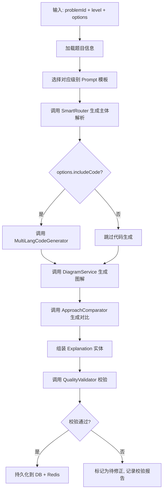

# Design: 内容生成引擎

## Overview

本设计文档定义内容生成引擎的技术实现方案。该引擎建立在 Spec 1 基础设施层之上，复用 AIProvider 接口、SmartRouter 路由层和 DiagramService 图解服务，实现从 Prompt 模板到高质量结构化教学内容的完整生成流水线。

## Architecture

### 系统架构总览

> **包路径说明**：本 spec 所有类统一使用 `com.algorithmhelp.content` 包路径，与 Spec 1 基础设施层的 `com.algorithmhelp` 保持一致。

```
REST API / CLI 触发
        ↓
┌─────────────────────────────────────────────────┐
│           ContentPipeline（生成编排层）            │
│  输入解析 → 模板选择 → AI调用 → 质量校验 → 持久化  │
└─────┬──────────┬──────────┬──────────┬──────────┘
      ↓          ↓          ↓          ↓
┌──────────┐ ┌──────────┐ ┌──────────┐ ┌──────────┐
│ Prompt   │ │ MultiLang│ │ Approach │ │ Quality  │
│ Template │ │ Code Gen │ │ Comparator│ │ Validator│
│ Engine   │ │          │ │          │ │          │
└──────────┘ └──────────┘ └──────────┘ └──────────┘
      ↓          ↓          ↓          ↓
┌─────────────────────────────────────────────────┐
│        SmartRouter（Spec 1 智能路由层）           │
│    Redis缓存 → Ollama → OpenAI → Anthropic      │
└─────────────────────────────────────────────────┘
      ↓
┌─────────────────────────────────────────────────┐
│       Storage（MySQL + Redis + 文件系统）     │
└─────────────────────────────────────────────────┘
```

### 模块职责

| 模块 | 职责 | 包路径 |
|------|------|--------|
| PromptTemplateEngine | 模板加载、变量填充、热更新 | `com.algorithmhelp.content.prompt` |
| LeveledGenerator | 按级别调用模板+AI生成内容 | `com.algorithmhelp.content.generator` |
| ContentPipeline | 单题生成全流程编排 | `com.algorithmhelp.content.pipeline` |
| MultiLangCodeGenerator | 多语言代码生成 | `com.algorithmhelp.content.codegen` |
| ApproachComparator | 解法对比与框架提炼 | `com.algorithmhelp.content.comparator` |
| QualityValidator | 内容质量校验 | `com.algorithmhelp.content.quality` |
| BatchGenerationService | 批量生成调度与进度追踪 | `com.algorithmhelp.content.batch` |
| SeedDataLoader | 种子数据加载 | `com.algorithmhelp.content.seed` |


## Components and Interfaces

### 组件总览

| 组件 | 接口/职责 | 依赖 |
|------|-----------|------|
| PromptTemplateEngine | render(path, vars): String | 文件系统 |
| LeveledGenerator | generate(problem, level): LeveledContent | PromptTemplateEngine, SmartRouter |
| ContentPipeline | generate(problemId, level, options): GenerationResult | 所有生成器 + SmartRouter |
| MultiLangCodeGenerator | generateForApproach(approach, problem): Map | PromptTemplateEngine, SmartRouter |
| ApproachComparator | compare(approaches, problem): ComparisonResult | PromptTemplateEngine, SmartRouter |
| QualityValidator | validate(explanation, level): ValidationReport | PromptTemplateEngine, SmartRouter |
| BatchGenerationService | startBatch(batchId, ids, options): void | ContentPipeline |
| SeedDataLoader | loadSeedProblems(): List<Problem> | 文件系统, ProblemRepository |

## Data Models

### 核心模型

```java
// 生成选项
@Data @Accessors(chain = true)
public class GenerateOptions {
    private boolean includeCode = true;
    private boolean includeDiagrams = true;
    private boolean includeComparison = true;
    private boolean includeApplications = true;
    private List<String> languages = List.of("python", "java", "go", "cpp");
}

// 生成结果
@Data @Accessors(chain = true)
public class GenerationResult {
    private Explanation explanation;
    private ValidationReport report;
    private String status;  // SUCCESS / PENDING_REVIEW / FAILED
    private long durationMs;
    private List<String> warnings;
}

// 代码片段
@Data @Accessors(chain = true)
public class CodeSnippet {
    private String language;
    private String code;
    private boolean hasComments;
}

// 对比结果
@Data @Accessors(chain = true)
public class ComparisonResult {
    private String evolutionMermaid;
    private List<ComparisonRow> matrix;
    private String commonFramework;
    private List<String> transferPath;
}

// 校验报告
@Data @Accessors(chain = true)
public class ValidationReport {
    private List<ValidationIssue> issues;
    public boolean isPassed() { ... }
}

// 批量进度
@Data @Accessors(chain = true)
public class BatchProgress {
    private int total;
    private int completed;
    private int failed;
    private int skipped;
    private String currentProblem;
    private BatchStatus status;
    private List<BatchFailure> failures;
    private long startTime;
}
```

## Component Design

### 1. PromptTemplateEngine

#### 文件组织

```
backend/src/main/resources/prompts/
├── explanation/
│   ├── L1-intuition.md        # L1直觉级模板
│   ├── L2-beginner.md         # L2入门级模板
│   ├── L3-intermediate.md     # L3进阶级模板
│   ├── L4-advanced.md         # L4熟练级模板
│   └── L5-expert.md           # L5专家级模板
├── codegen/
│   ├── python.md              # Python代码生成模板
│   ├── java.md                # Java代码生成模板
│   ├── go.md                  # Go代码生成模板
│   └── cpp.md                 # C++代码生成模板
├── diagram/
│   └── mermaid-generate.md    # 图解生成模板
├── quality/
│   ├── ai-review.md           # AI自审模板
│   └── logic-check.md         # 逻辑校验模板
└── comparator/
    ├── evolution-graph.md     # 解法演进关系模板
    └── framework-extract.md   # 底层框架提炼模板
```

#### 核心类设计

```java
@Component
public class PromptTemplateEngine {

    private final Map<String, CachedTemplate> cache = new ConcurrentHashMap<>();
    private final Path templateDir;

    // 加载并填充模板
    public String render(String templatePath, Map<String, String> variables) { ... }

    // 检查文件修改时间，实现热更新
    private String loadTemplate(String path) { ... }
}

@Data
@Accessors(chain = true)
class CachedTemplate {
    private String content;
    private long lastModified;
}
```

#### 变量占位符规范

| 变量名 | 含义 | 来源 |
|--------|------|------|
| `{{problemId}}` | 题目ID | Problem 实体 |
| `{{problemTitle}}` | 题目标题 | Problem 实体 |
| `{{difficulty}}` | 难度 | Problem 实体 |
| `{{tags}}` | 标签列表 | Problem 实体 |
| `{{description}}` | 题目描述 | Problem 实体 |
| `{{constraints}}` | 约束条件 | Problem 实体 |
| `{{examples}}` | 输入输出示例 | Problem 实体 |
| `{{level}}` | 目标级别(1-5) | 请求参数 |
| `{{algorithmType}}` | 算法类型 | 推断/标签 |
| `{{targetLang}}` | 目标编程语言 | 请求参数 |
| `{{approaches}}` | 已有解法列表 | 生成中间结果 |

### 2. Prompt 模板示例

#### L1 直觉级模板（prompts/explanation/L1-intuition.md）

```markdown
你是一个擅长用生活类比解释复杂概念的算法教育家。

## 任务
为以下算法题生成 L1（直觉级）的解释。

## 题目信息
- 标题：{{problemTitle}}
- 描述：{{description}}
- 示例：{{examples}}

## L1 级别规范
- 绝不出现代码、伪代码、或任何编程术语
- 每个概念用一个生活场景类比
- 用"你"的口吻，像朋友聊天
- 例子不超过5个元素
- 可以"不严谨但不错误"
- 结尾必须有🎯一句话核心直觉

## 输出结构（严格 JSON）
{
  "intuition": "一句话核心直觉",
  "analogy": "主要类比场景",
  "story": "故事化解释（3-5段）",
  "alternativeAnalogies": ["类比2", "类比3"],
  "memoryAnchor": "认知锚点（极简记忆触发点）"
}
```

#### L3 进阶级模板（prompts/explanation/L3-intermediate.md）

```markdown
你是一个算法教学专家，擅长模式识别和框架提炼。

## 任务
为以下算法题生成 L3（进阶级）的完整解析。

## 题目信息
- 标题：{{problemTitle}}
- 难度：{{difficulty}}
- 标签：{{tags}}
- 描述：{{description}}
- 约束：{{constraints}}
- 示例：{{examples}}

## L3 级别规范
- 重点是"模式"和"框架"
- 必须有多解法对比（至少暴力→优化→最优）
- 标注"什么信号下该用这个方法"
- 揭示底层共同思路
- 代码精简，不需逐行注释（L2才需要）
- 必须有模板代码（通用可复用）
- 必须列出关联题目

## 输出结构（严格 JSON）
{
  "patternRecognition": {
    "pattern": "所属模式名称",
    "signals": ["识别信号1", "信号2"],
    "category": "模式大类"
  },
  "approaches": [
    {
      "name": "解法名称",
      "idea": "核心思路",
      "steps": ["步骤1", "步骤2"],
      "code": "Python代码",
      "timeComplexity": "O(?)",
      "spaceComplexity": "O(?)",
      "whyThisWorks": "为什么有效",
      "whenToUse": "适用场景"
    }
  ],
  "comparisonMatrix": { ... },
  "commonFramework": "底层共同思路提炼",
  "templateCode": "通用模板代码",
  "relatedProblems": ["题目1", "题目2"],
  "transferPath": "思路迁移路径"
}
```


### 3. ContentPipeline（单题生成流水线）

#### 流程图



#### 核心类设计

```java
@Service
@RequiredArgsConstructor
public class ContentPipeline {

    private final ProblemRepository problemRepo;
    private final PromptTemplateEngine templateEngine;
    private final SmartRouter smartRouter;
    private final MultiLangCodeGenerator codeGenerator;
    private final DiagramService diagramService;
    private final ApproachComparator comparator;
    private final QualityValidator validator;
    private final ExplanationRepository explanationRepo;

    /**
     * 单题完整解析生成
     */
    public GenerationResult generate(String problemId, int level, GenerateOptions options) {
        // 1. 加载题目
        var problem = loadProblem(problemId);
        // 2. 构建 prompt 变量
        var variables = buildVariables(problem, level);
        // 3. 渲染模板并调用 AI
        var rawContent = callAiWithTemplate(level, variables);
        // 4. 解析 AI 响应为结构化对象
        var explanation = parseResponse(rawContent, problem, level);
        // 5. 补充多语言代码（如果启用）
        if (options.isIncludeCode()) {
            enrichWithMultiLangCode(explanation);
        }
        // 6. 生成图解
        enrichWithDiagrams(explanation, problem);
        // 7. 生成解法对比
        enrichWithComparison(explanation);
        // 8. 质量校验
        var report = validator.validate(explanation, level);
        // 9. 持久化
        return persistResult(explanation, report);
    }
}
```

#### 生成选项

```java
@Data
@Accessors(chain = true)
public class GenerateOptions {
    private boolean includeCode = true;         // 是否生成多语言代码
    private boolean includeDiagrams = true;     // 是否生成图解
    private boolean includeComparison = true;   // 是否生成解法对比
    private boolean includeApplications = true; // 是否生成实际应用
    private List<String> languages = List.of("python", "java", "go", "cpp");
}
```

### 4. MultiLangCodeGenerator

```java
@Service
@RequiredArgsConstructor
public class MultiLangCodeGenerator {

    private final PromptTemplateEngine templateEngine;
    private final SmartRouter smartRouter;

    // 支持的语言列表
    private static final List<String> SUPPORTED_LANGS = List.of("python", "java", "go", "cpp");

    /**
     * 为单个解法生成多语言代码
     */
    public Map<String, CodeSnippet> generateForApproach(Approach approach, Problem problem) {
        Map<String, CodeSnippet> result = new LinkedHashMap<>();
        for (String lang : SUPPORTED_LANGS) {
            var variables = Map.of(
                "approach", approach.getIdea(),
                "steps", String.join("\n", approach.getSteps()),
                "targetLang", lang,
                "problemTitle", problem.getTitle()
            );
            var prompt = templateEngine.render("codegen/" + lang + ".md", variables);
            var code = smartRouter.call(prompt);
            result.put(lang, parseCodeSnippet(code, lang));
        }
        return result;
    }
}

@Data
@Accessors(chain = true)
public class CodeSnippet {
    private String language;
    private String code;            // 含注释的完整代码
    private boolean hasComments;    // 是否包含中文注释
}
```

### 5. QualityValidator

```java
@Service
@RequiredArgsConstructor
public class QualityValidator {

    private final PromptTemplateEngine templateEngine;
    private final SmartRouter smartRouter;

    /**
     * 综合质量校验
     */
    public ValidationReport validate(Explanation explanation, int level) {
        var report = new ValidationReport();

        // 1. 格式校验（本地规则，无需 AI）
        report.addAll(validateFormat(explanation));

        // 2. 级别符合性校验（本地规则）
        report.addAll(validateLevelCompliance(explanation, level));

        // 3. Mermaid 语法校验（本地解析）
        report.addAll(validateMermaid(explanation));

        // 4. AI 自审（逻辑正确性）
        if (report.getErrors().isEmpty()) {
            report.addAll(aiReview(explanation));
        }

        return report;
    }
}

@Data
@Accessors(chain = true)
public class ValidationReport {
    private List<ValidationIssue> issues = new ArrayList<>();

    public boolean isPassed() {
        return issues.stream().noneMatch(i -> i.getSeverity() == Severity.ERROR);
    }
}

@Data
@Accessors(chain = true)
public class ValidationIssue {
    private String type;        // FORMAT / LEVEL / MERMAID / LOGIC
    private Severity severity;  // ERROR / WARNING / INFO
    private String location;    // 问题位置
    private String message;     // 问题描述
    private String suggestion;  // 建议修复方式
}
```


### 6. ApproachComparator

```java
@Service
@RequiredArgsConstructor
public class ApproachComparator {

    private final PromptTemplateEngine templateEngine;
    private final SmartRouter smartRouter;

    /**
     * 生成解法对比与框架提炼
     */
    public ComparisonResult compare(List<Approach> approaches, Problem problem) {
        // 1. 生成演进关系图（Mermaid）
        var evolutionGraph = generateEvolutionGraph(approaches);
        // 2. 生成多维对比矩阵
        var matrix = generateComparisonMatrix(approaches);
        // 3. 提炼底层共同思路
        var commonFramework = extractCommonFramework(approaches, problem);
        // 4. 生成迁移路径
        var transferPath = generateTransferPath(commonFramework);

        return new ComparisonResult()
            .setEvolutionMermaid(evolutionGraph)
            .setMatrix(matrix)
            .setCommonFramework(commonFramework)
            .setTransferPath(transferPath);
    }
}

@Data
@Accessors(chain = true)
public class ComparisonResult {
    private String evolutionMermaid;                    // 演进关系 Mermaid 图
    private List<ComparisonRow> matrix;                 // 多维对比矩阵
    private String commonFramework;                     // 底层共同思路
    private List<String> transferPath;                  // 迁移路径题目列表
}

@Data
@Accessors(chain = true)
public class ComparisonRow {
    private String approachName;
    private String timeComplexity;
    private String spaceComplexity;
    private int codeComplexity;         // 1-5 代码复杂度评分
    private String applicableScene;     // 适用场景
    private int interviewRecommendation; // 1-5 面试推荐度
}
```

### 7. BatchGenerationService

```java
@Service
@RequiredArgsConstructor
public class BatchGenerationService {

    private final ContentPipeline pipeline;
    private final SeedDataLoader seedLoader;
    private final ConcurrentHashMap<String, BatchProgress> progressMap = new ConcurrentHashMap<>();

    @Value("${content.batch.concurrency:3}")
    private int maxConcurrency;

    /**
     * 启动批量生成任务
     */
    @Async
    public void startBatch(String batchId, List<String> problemIds, GenerateOptions options) {
        var progress = new BatchProgress()
            .setTotal(problemIds.size())
            .setStatus(BatchStatus.RUNNING);
        progressMap.put(batchId, progress);

        var semaphore = new Semaphore(maxConcurrency);

        for (String problemId : problemIds) {
            semaphore.acquire();
            try {
                generateWithRetry(problemId, options, progress);
            } finally {
                semaphore.release();
            }
        }

        progress.setStatus(BatchStatus.COMPLETED);
    }

    private void generateWithRetry(String problemId, GenerateOptions options, BatchProgress progress) {
        int maxRetries = 3;
        for (int attempt = 1; attempt <= maxRetries; attempt++) {
            try {
                // 断点续生成：跳过已成功的
                if (isAlreadyGenerated(problemId)) {
                    progress.incrementSkipped();
                    return;
                }
                pipeline.generate(problemId, 3, options); // 默认生成 L3
                progress.incrementCompleted();
                return;
            } catch (Exception e) {
                if (attempt == maxRetries) {
                    progress.addFailure(problemId, e.getMessage());
                }
            }
        }
    }

    public BatchProgress getProgress(String batchId) {
        return progressMap.get(batchId);
    }
}

@Data
@Accessors(chain = true)
public class BatchProgress {
    private int total;
    private int completed;
    private int failed;
    private int skipped;
    private String currentProblem;
    private BatchStatus status;
    private List<BatchFailure> failures = new ArrayList<>();
    private long startTime;

    public String getEstimatedRemaining() { ... }
}
```

### 8. SeedDataLoader

```java
@Component
public class SeedDataLoader {

    private static final String SEED_FILE = "data/seed/problems-50.json";

    /**
     * 加载50题种子数据
     */
    public List<Problem> loadSeedProblems() {
        // 从 JSON 文件读取，反序列化为 Problem 列表
    }

    /**
     * 初始化：将种子数据写入数据库（如果不存在）
     */
    @PostConstruct
    public void initSeedData() {
        // 幂等写入，已存在则跳过
    }
}
```

## Data Flow

### 单题生成数据流

```
请求输入 (problemId=1, level=3, options)
  ↓
Problem DB 查询 → Problem 实体
  ↓
PromptTemplateEngine.render("explanation/L3-intermediate.md", variables)
  ↓ 生成完整 prompt 文本
SmartRouter.call(prompt) → AI 原始响应 (JSON字符串)
  ↓ JSON 解析
结构化 Explanation 对象
  ↓ 并行补充
├── MultiLangCodeGenerator → Map<lang, CodeSnippet>
├── DiagramService.generateForProblem() → Mermaid 代码
└── ApproachComparator.compare() → ComparisonResult
  ↓ 组装
完整 Explanation 实体
  ↓
QualityValidator.validate() → ValidationReport
  ↓ (通过)
ExplanationRepository.save() + Redis 缓存写入
```

### 批量生成数据流

```
POST /api/batch/generate {levels: [2,3], concurrency: 3}
  ↓
SeedDataLoader.loadSeedProblems() → 50题列表
  ↓
BatchGenerationService.startBatch(batchId, problemIds, options)
  ↓ (异步，信号量控制并发)
┌──────────────────────────────────────┐
│ Semaphore(3)                         │
│ ├── Thread-1: generate(problem-1)    │
│ ├── Thread-2: generate(problem-2)    │
│ └── Thread-3: generate(problem-3)    │
│ ...轮转直到50题完成                    │
└──────────────────────────────────────┘
  ↓
进度查询: GET /api/batch/{batchId}/progress
  → {total:50, completed:32, failed:1, current:"problem-33"}
```

## Level-Specific Generation Rules

| 级别 | Prompt 模板 | 输出结构要求 | 校验规则 |
|------|-------------|-------------|----------|
| L1 | 零代码、纯类比、故事化 | intuition + analogy + story + memoryAnchor | 不得包含代码/伪代码 |
| L2 | 具体例子+伪代码+图解 | steps + pseudocode + diagrams + annotatedCode | 每步配图，代码逐行注释 |
| L3 | 模式框架+多解法对比 | pattern + approaches[] + templateCode + related | 至少2种解法，必须有模板代码 |
| L4 | 边界分析+优化+证明 | proofs + edgeCases + optimizations + interview | 必须有复杂度推导过程 |
| L5 | 论文+数学+前沿 | papers[] + proofs + frontierApps + openProblems | 至少1篇论文引用 |

## API Extensions

在 Spec 1 的 REST API 基础上新增：

| 端点 | 方法 | 描述 |
|------|------|------|
| `/api/problems/{id}/generate` | POST | 触发单题生成（已有，增强） |
| `/api/batch/generate` | POST | 触发批量生成 |
| `/api/batch/{batchId}/progress` | GET | 查询批量生成进度 |
| `/api/seed/init` | POST | 初始化种子数据 |
| `/api/quality/report/{explanationId}` | GET | 获取质量校验报告 |

## Configuration

```yaml
# application.yml 新增配置
content:
  prompt:
    template-dir: classpath:prompts/  # 模板目录
    cache-enabled: true               # 模板缓存开关
  batch:
    concurrency: 3                    # 批量生成并发数
    max-retries: 3                    # 单题最大重试次数
    retry-delay-ms: 2000              # 重试间隔
  quality:
    ai-review-enabled: true           # AI自审开关
    mermaid-validation: true          # Mermaid语法校验开关
    level-compliance: true            # 级别符合性校验开关
  seed:
    file-path: data/seed/problems-50.json
    auto-init: true                   # 启动时自动初始化种子数据
```

## Error Handling

| 错误场景 | 处理策略 | 用户可见行为 |
|----------|----------|-------------|
| AI 调用超时 | 重试1次，仍失败则抛 AiProviderException | 返回 500 + 错误描述 |
| AI 返回非 JSON | AiResponseParser 尝试提取 JSON，失败标记为需人工处理 | 降级为原始文本存储 |
| 模板文件不存在 | 抛出 TemplateNotFoundException | 返回 500 + 模板缺失提示 |
| 变量未填充 | 抛出 TemplateRenderException | 返回 400 + 缺失变量名 |
| 题目不存在 | 抛出 ResourceNotFoundException | 返回 404 |
| 批量生成单题失败 | 重试3次，仍失败记录并跳过 | 进度中显示失败数 |
| Mermaid 语法错误 | QualityValidator 标记 WARNING | 内容正常保存，标记图解异常 |
| 质量校验逻辑错误 | 标记 status=PENDING_REVIEW | 不对外暴露，后台人工审核 |

## Testing Strategy

### 单元测试
- PromptTemplateEngine：模板加载、变量替换、热更新、异常处理
- LevelComplianceChecker：各级别校验规则（构造正/反例）
- AiResponseParser：正常 JSON、包裹文字 JSON、非法格式
- BatchProgress：并发更新计数正确性

### 集成测试
- ContentPipeline：使用 StaticProvider mock AI，验证全流程编排
- BatchGenerationService：3题并发生成，验证信号量和重试逻辑
- QualityValidator：构造各类问题验证检出率

### Mock 策略
- AI 调用全部通过 StaticProvider 或 Mock SmartRouter 返回预制响应
- 数据库使用 H2 内存数据库
- Redis 使用 Embedded Redis 或 Mock

## Correctness Properties

### Property 1: 模板幂等性
相同输入变量 + 相同模板文件 → 相同 prompt 输出。PromptTemplateEngine.render() 对于相同参数始终返回相同字符串。

**Validates: Requirement 1.2, 1.4**

### Property 2: 级别隔离
L1 生成结果不包含代码块（无 ``` 标记），L5 生成结果包含至少一条论文引用（匹配 `[Author, Year]` 格式）。

**Validates: Requirement 2.1, 2.5, 2.7**

### Property 3: 批量进度一致性
在任意时刻：completed + failed + skipped ≤ total。任务结束时：completed + failed + skipped = total。

**Validates: Requirement 5.4**

### Property 4: 断点续生成幂等
已成功持久化的题目在重新触发批量生成时被跳过，不会重复调用 AI。

**Validates: Requirement 5.5**

### Property 5: 质量校验完整性
所有通过 ContentPipeline 生成的 Explanation 都关联一个 ValidationReport，不存在无校验报告的已发布内容。

**Validates: Requirement 6.5, 6.6**

## Component Design: L5 论文引用校验

### KnownReferenceRegistry

```java
@Component
public class KnownReferenceRegistry {

    private volatile List<KnownReference> references;
    private final Path referenceFile;

    @PostConstruct
    public void init() {
        // 从 known-references.json 加载已知权威来源列表
        this.references = loadFromFile();
    }

    /**
     * 检查引用是否在已知列表中
     * @return 匹配到的已知来源，或 empty
     */
    public Optional<KnownReference> match(String citation) {
        // 模糊匹配：作者名+年份+书名/论文名 任一匹配即通过
    }

    public List<ReferenceCheckResult> checkAll(List<String> citations) {
        return citations.stream()
            .map(c -> new ReferenceCheckResult(c, match(c).isPresent()))
            .toList();
    }
}

@Data @Accessors(chain = true)
public class KnownReference {
    private String type;        // TEXTBOOK / PAPER / COURSE
    private String name;        // "CLRS" / "Dijkstra 1959"
    private List<String> aliases;  // 匹配别名
    private String chapter;     // 可选：章节
}

@Data @Accessors(chain = true)
public class ReferenceCheckResult {
    private String citation;
    private boolean verified;
}
```

### 已知来源数据文件

路径：`backend/src/main/resources/data/known-references.json`

```json
{
  "textbooks": [
    { "name": "CLRS", "aliases": ["Introduction to Algorithms", "Cormen"], "chapters": ["1-35"] },
    { "name": "TAOCP", "aliases": ["The Art of Computer Programming", "Knuth"], "volumes": ["1-4"] },
    { "name": "Concrete Mathematics", "aliases": ["Graham", "Knuth", "Patashnik"] }
  ],
  "courses": [
    { "name": "MIT 6.006", "aliases": ["Introduction to Algorithms MIT"] },
    { "name": "MIT 6.046", "aliases": ["Design and Analysis of Algorithms"] },
    { "name": "Stanford CS161", "aliases": ["Design and Analysis of Algorithms Stanford"] }
  ],
  "papers": [
    { "name": "Dijkstra 1959", "title": "A note on two problems in connexion with graphs" },
    { "name": "Knuth-Morris-Pratt 1977", "title": "Fast Pattern Matching in Strings" },
    { "name": "Tarjan 1972", "title": "Depth-First Search and Linear Graph Algorithms" }
  ]
}
```

### QualityValidator L5 校验集成

在 `QualityValidator.validate()` 中，当 level == 5 时额外执行：

```java
if (level == 5) {
    var citations = extractCitations(explanation); // 正则提取引用
    var results = referenceRegistry.checkAll(citations);
    results.stream()
        .filter(r -> !r.isVerified())
        .forEach(r -> report.addIssue(new ValidationIssue()
            .setType("REFERENCE")
            .setSeverity(Severity.WARNING)
            .setMessage("引用未经验证: " + r.getCitation())
            .setSuggestion("建议人工确认该引用的准确性")));
}
```

## Component Design: 反向费曼错误分类

### ErrorClassification 枚举与 Prompt 模板扩展

```java
public enum FeynmanErrorType {
    LOGIC,       // 逻辑错误：推理步骤有误
    NUMERIC,     // 数值错误：具体数字算错
    BOUNDARY,    // 边界错误：边界条件处理不当
    COMPLEXITY,  // 复杂度错误：时间/空间分析有误
    CONCEPT      // 概念错误：核心概念理解偏差
}

public enum FeynmanDifficulty {
    EASY,    // 简单档：LOGIC + NUMERIC
    MEDIUM,  // 中等档：BOUNDARY + COMPLEXITY
    HARD     // 困难档：CONCEPT
}
```

### Prompt 模板扩展

路径：`resources/prompts/interactive/reverse-feynman-generate.md`

模板中新增约束段：

```markdown
## 错误分类要求
生成的错误 MUST 标注以下分类属性：
- errorType: LOGIC | NUMERIC | BOUNDARY | COMPLEXITY | CONCEPT
- difficulty: EASY | MEDIUM | HARD

## 难度对应规则
- EASY 模式：只使用 LOGIC 或 NUMERIC 类型错误（用户容易发现）
- MEDIUM 模式：使用 BOUNDARY 或 COMPLEXITY 类型错误（需要推理才能发现）
- HARD 模式：使用 CONCEPT 类型错误（概念层面的微妙错误，看起来合理但本质有问题）

## 输出 JSON 中新增字段
{
  "errorType": "BOUNDARY",
  "errorDifficulty": "MEDIUM",
  "errorDescription": "错误的具体描述（供系统记录，不展示给用户）"
}
```

### 用户纠错能力追踪

```java
@Data @Accessors(chain = true)
public class ErrorTypeStats {
    private Long userId;
    private FeynmanErrorType errorType;
    private int totalAttempts;
    private int successCount;

    public double getSuccessRate() {
        return totalAttempts == 0 ? 0 : (double) successCount / totalAttempts;
    }
}
```

系统在选择下次训练的错误类型时，对成功率 < 50% 的类型提高出现概率（加权随机）。

## Component Design: 复杂度训练题预置数据

### 数据文件结构

路径：`data/static/complexity-training.json`

```json
{
  "version": "1.0",
  "problems": [
    {
      "id": "range-001",
      "mode": "RANGE_GUESS",
      "constraints": "给定 n ≤ 10^5 个整数，找到最长递增子序列",
      "options": ["O(n)", "O(n log n)", "O(n²)", "O(2^n)", "O(n³)"],
      "correctAnswer": "O(n log n)",
      "explanation": "n ≤ 10^5 意味着 O(n²) 约 10^10 会超时...",
      "relatedAlgorithms": ["DP + 二分", "贪心 + 二分"],
      "difficulty": "MEDIUM"
    },
    {
      "id": "code-001",
      "mode": "CODE_ESTIMATE",
      "code": "def func(arr):\n    n = len(arr)\n    for i in range(n):\n        for j in range(i+1, n):\n            if arr[i] > arr[j]:\n                arr[i], arr[j] = arr[j], arr[i]\n    return arr",
      "language": "python",
      "options": ["O(n)", "O(n log n)", "O(n²)", "O(n³)", "O(2^n)"],
      "correctAnswer": "O(n²)",
      "explanation": "双重循环，外层 n 次，内层平均 n/2 次...",
      "difficulty": "EASY"
    }
  ]
}
```

### SeedDataLoader 扩展

```java
@Component
public class ComplexityTrainingLoader {

    private static final String TRAINING_FILE = "data/static/complexity-training.json";

    @PostConstruct
    public void initTrainingData() {
        // 幂等导入：检查 DB 中是否已有训练题，无则导入
    }
}
```

## Scope

### 包含
- PromptTemplateEngine 模板系统（含热更新）
- 5个级别的 Prompt 模板文件
- ContentPipeline 单题生成全流程
- MultiLangCodeGenerator 四语言代码生成
- ApproachComparator 解法对比与框架提炼
- QualityValidator 三层质量校验
- BatchGenerationService 批量生成调度
- SeedDataLoader 50题种子数据
- 新增 REST API 端点

### 不包含
- 前端页面修改（Spec 3 处理）
- 用户交互功能（费曼模式等，后续 Spec）
- 间隔重复系统
- 面试模拟模式
- 实际 50 题的 AI 生成内容（本 spec 搭建能力，内容另行触发生成）
